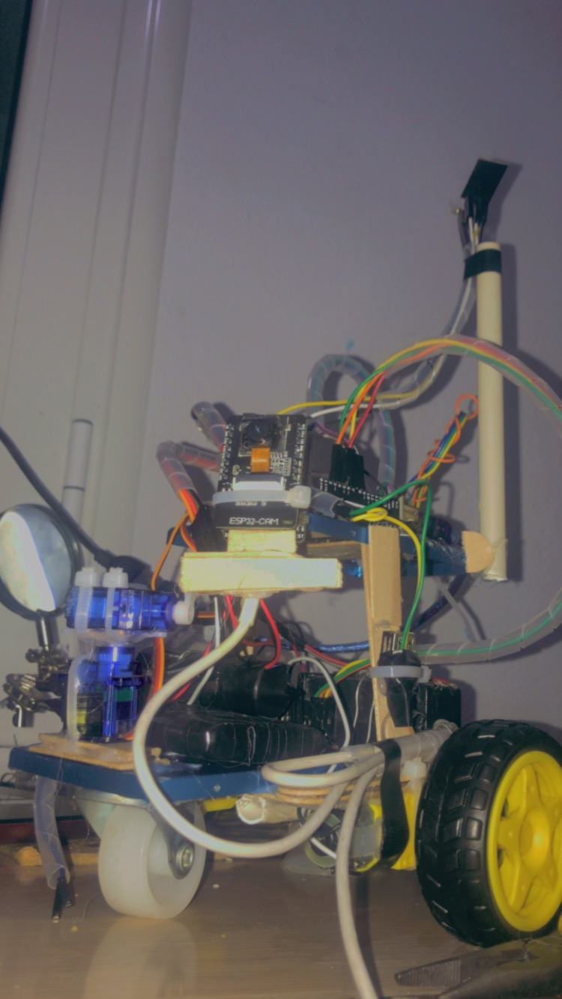
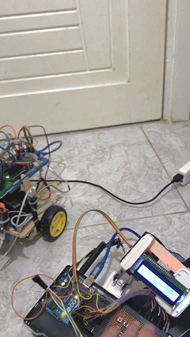
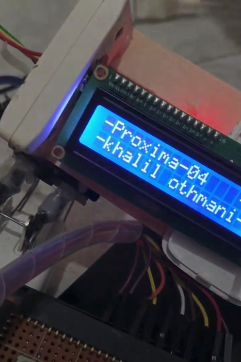
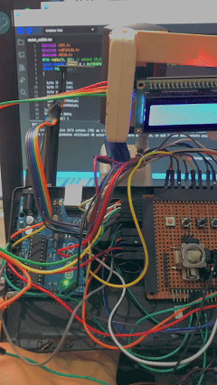

# 🤖 PROXIMA — Explorational Rover Robot

Proxima is a small exploration robot designed to navigate and observe its surroundings using a movable camera head and wireless remote control.  
The goal of this project is to create a compact rover capable of exploring environments, sending live camera footage, and responding smoothly to analog joystick input.

  

---

## 🚀 Features
- **ESP32-CAM** for live video streaming  
- **Movable camera head (2 DOF)** using two servo motors  
- **RF24 wireless communication** between robot and remote  
- **Analog joystick control** for:
  - Robot movement (forward, backward, left, right)
  - Camera panning (X/Y axis)
  - Speed control
- **LCD screen on remote** to display joystick values  
- **L293D motor driver** to control two DC motors  
- **Omnidirectional back wheel** + **two front DC motors**

---
  

## 🧠 Hardware Used
### **Robot**
- Arduino Uno  
- ESP32-CAM (separate from Arduino)  
- L293D motor driver  
- 2 × DC motors  
- 2 × SG90/servos for the camera head  
- RF24 module  
- Omnidirectional support wheel  
- Battery pack  

### **Remote**
- Arduino (Uno/Nano)  
- RF24 module  
- LCD 16×2  
- Two analog joysticks  
- Buttons (optional)

---

  

## 📡 How It Works

### **Remote**
The remote reads two joysticks:
- **Joystick 1:**  
  - X → turn left/right  
  - Y → forward/backward speed  
- **Joystick 2:**  
  - X → camera pan  
  - Y → camera tilt  

These values are shown on the LCD screen.  
The remote sends analog values through **RF24** to the robot in a data packet.

---
  

### **Robot**
The robot receives the joystick values and:
- Drives the motors using **PWM signals** (L293D)  
- Moves the camera head using **two servos**  
- Uses the ESP32-CAM for live video feed (WiFi separate from RF)

## PROXIMA ROVER WIRING:

# ARDUINO UNO

[POWER]
- 5V  →  L293D (Vcc1)
- 5V  →  Servo X (Vcc)
- 5V  →  Servo Y (Vcc)
- GND →  All grounds connected together (VERY IMPORTANT)
- GND →  L293D (GND)
- GND →  ESP32-CAM GND
- GND →  NRF24 GND

[NRF24 MODULE]
- CE   →  Pin 7
- CSN  →  Pin 8
- MOSI →  Pin 11
- MISO →  Pin 12
- SCK  →  Pin 13
- VCC  →  3.3V
- GND  →  GND

[SERVO MOTORS (CAMERA HEAD)]
- Servo X signal → Pin 2
- Servo X Vcc    → 5V
- Servo X GND    → GND

- Servo Y signal → Pin 13
- Servo Y Vcc    → 5V
- Servo Y GND    → GND

  # MOTOR DRIVER (L293D)

[LEFT MOTOR]
- IN1 → Pin 6
- IN2 → Pin 5
- ENA → Pin 9 (PWM)
- Motor Outputs → Left motor terminals

[RIGHT MOTOR]
- IN3 → Pin 4
- IN4 → Pin 3
- ENB → Pin 10 (PWM)
- Motor Outputs → Right motor terminals

[POWER INPUT]
- Vcc1  → 5V from Arduino
- Vcc2  → Battery pack (for motors, usually 6–12V)
- GND   → Common ground (Arduino + Battery + L293D)

  # ESP32-CAM

NOTE: ESP32-CAM is independent, not controlled by Arduino.

[POWER]
- 5V  →  External 5V booster OR separate 5V regulator
- GND →  Common ground with Arduino

[OTHER]
- ESP32 streams video over WiFi
- RX/TX not required unless debugging

# BATTERY PACK

For motors:
- Battery (+) → L293D Vcc2
- Battery (–) → Common GND

For ESP32-CAM:
- 5V stable supply → ESP32 5V pin

For Arduino:
- Vin or USB

MAKE SURE GROUNDS ARE ALL CONNECTED.

## PROXIMA REMOTE WIRING

# ARDUINO UNO

[POWER]
- 5V  →  LCD Vcc
- 5V  →  Joystick 1 Vcc
- 5V  →  Joystick 2 Vcc
- 3.3V → NRF24 Vcc
- GND →  All GNDs connected together (IMPORTANT)

  # NRF24 MODULE

CE   → Pin 7  
CSN  → Pin 8  
MOSI → Pin 11  
MISO → Pin 12  
SCK  → Pin 13  
VCC  → 3.3V  
GND  → GND  

  # JOYSTICK 1 (MOVEMENT)

VRx → A0  
VRy → A1  
SW  → Not used (optional)  
Vcc → 5V  
GND → GND  

Function:  
- X-axis (A0) controls left/right turning  
- Y-axis (A1) controls forward/backward speed  

  # JOYSTICK 2 (CAMERA HEAD)

VRx → A2  
VRy → A3  
SW  → Not used  
Vcc → 5V  
GND → GND  

Function:  
- X-axis (A2) controls camera left/right  
- Y-axis (A3) controls camera up/down  

  # LCD 16x2 (Standard 6-Pin Mode)

RS → Pin 12  
E  → Pin 11  
D4 → Pin 5  
D5 → Pin 4  
D6 → Pin 3  
D7 → Pin 2  

Vcc → 5V  
GND → GND  
VO  → Potentiometer (contrast control)  

(If using a 10k pot)
- Pot middle pin → VO  
- Pot side pins → 5V and GND  

  ## OVERVIEW CONNECTIONS

Arduino UNO:
- A0 → Joystick #1 X  
- A1 → Joystick #1 Y  
- A2 → Joystick #2 X  
- A3 → Joystick #2 Y  

- Pins 2–5 → LCD data  
- Pins 11–12 → LCD control  
- Pins 7–8 → NRF24 control  
- Pins 11–13 → SPI (shared with LCD but no conflict)

# POWER NOTES

- NRF24 *must* use 3.3V  
- All grounds must be connected  
- If NRF24 is unstable, add 10µF capacitor across 3.3V and GND  

## 📷 ESP32-CAM Camera System

(See first picture — the rover’s head module contains the mounted camera)
The ESP32-CAM handles real-time video streaming over Wi-Fi and functions separately from the Arduino system. This makes the camera lightweight, responsive, and fully autonomous, without consuming Arduino pins or processing power.
The ESP32-CAM code is available in the repository here: /code 

🔧 How the Camera Integrates Into Nova

The camera uses Wi-Fi streaming, not RF or Arduino serial.

It is powered directly from the rover’s 5V supply.

It does not communicate with the Arduino UNO — the video feed is accessed from a smartphone or computer through the ESP32-CAM's IP address.

This makes the rover modular:

Arduino handles motors + sensors

nRF24L01 handles wireless control

ESP32-CAM handles streaming independently

🛠️ Installing ESP32-CAM Support (Arduino IDE)

To upload firmware to the ESP32-CAM AI-Thinker board, follow these exact steps:

1️⃣ Install the ESP32 Board Manager

Open Arduino IDE

Go to:
File → Preferences

Under Additional Boards Manager URLs, add:

https://dl.espressif.com/dl/package_esp32_index.json

Go to:
Tools → Board → Boards Manager

Search for “ESP32”

Install esp32 by Espressif Systems

🚀 Uploading the Code

Connect the wiring exactly as above.

Select the board:
Tools → Board → ESP32 Arduino → AI Thinker ESP32-CAM

Select the port of the Arduino UNO.

Press Upload.

When “Connecting…” appears:

Press RESET on the ESP32-CAM (if your board has it)

Or unplug/plug 5V once

After upload:

Disconnect IO0 from GND

Press RESET again

The camera will boot normally

🌐 Viewing the Video Stream

The code in /code/esp32cam/ automatically launches a local Wi-Fi access point or connects to your Wi-Fi (depending on configuration).

After the ESP32-CAM boots:

Open Serial Monitor at 115200 baud

It prints the streaming URL, usually something like:

http://192.168.4.1/

Open this link in any browser to view the real-time camera stream.

## Algorithm Overview
# Pseudocode for Remote (Transmitter)
BEGIN REMOTE

INITIALIZE RF24 radio with CE and CSN pins
INITIALIZE LCD display

SET joystick pins:
    - Movement joystick X, Y
    - Camera joystick X, Y

CREATE data packet:
    moveX, moveY, headX, headY

SET radio to writing mode

DISPLAY "PROXIMA Remote" on LCD

LOOP FOREVER:
    READ analog values from:
        - Movement joystick X → packet.moveX
        - Movement joystick Y → packet.moveY
        - Camera joystick X   → packet.headX
        - Camera joystick Y   → packet.headY

    SEND packet through RF24

    CLEAR LCD
    DISPLAY moveX and moveY on first row
    DISPLAY headX and headY on second row

    WAIT 100 ms
END LOOP

END REMOTE

# Pseudocode for Rover (Receiver)

BEGIN ROVER

INITIALIZE RF24 radio with CE and CSN pins
INITIALIZE motor driver pins for:
    - Left motor: enA, in1, in2
    - Right motor: enB, in3, in4

ATTACH servo motors:
    - servoX for left/right camera movement
    - servoY for up/down camera movement

SET radio to reading mode

CREATE data packet structure:
    moveX, moveY, headX, headY

FUNCTION driveMotors(speed, turn):
    CALCULATE leftMotor  = speed + turn
    CALCULATE rightMotor = speed - turn

    LIMIT leftMotor and rightMotor to range (-255, +255)

    IF leftMotor > 0:
        SET left motor forward
    ELSE:
        SET left motor backward
    SET left motor speed = ABS(leftMotor)

    IF rightMotor > 0:
        SET right motor forward
    ELSE:
        SET right motor backward
    SET right motor speed = ABS(rightMotor)
END FUNCTION

LOOP FOREVER:
    IF radio receives new packet:
        READ packet values

        MAP packet.moveY from (0–1023) to (-255–255) → speed
        MAP packet.moveX from (0–1023) to (-255–255) → turn

        CALL driveMotors(speed, turn)

        MAP packet.headX from (0–1023) to (0–180) → camX
        MAP packet.headY from (0–1023) to (0–180) → camY

        WRITE camX to servoX
        WRITE camY to servoY
    END IF
END LOOP

END ROVER

## 🏁 Getting Started

1. Assemble the rover and remote according to wiring diagrams.
2. Upload Arduino code to the rover and remote.
3. Upload ESP32-CAM code to the camera module.
4. Power both systems (battery for rover, USB or battery for remote).
5. Connect to the ESP32-CAM Wi-Fi or local network to view video.
6. Use the remote to move the robot and control the camera head.

